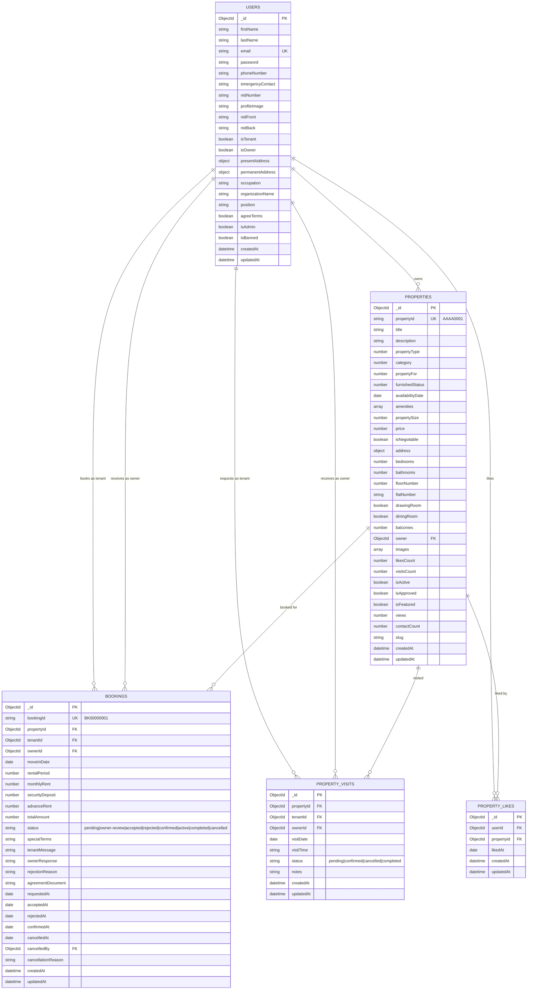
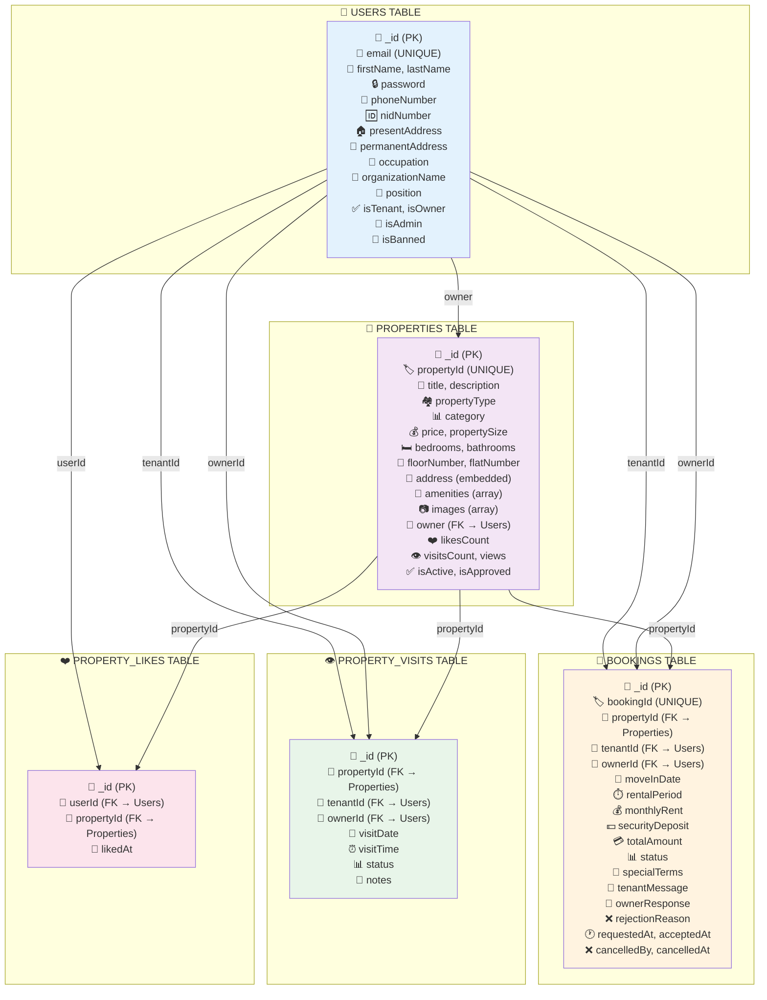

# erdiagram

# 🏠 Property Rental System - Database Architecture

## 📊 Entity Relationship Diagram



---

## 🔄 Booking Process Flowchart

```mermaid
flowchart TD
    Start([User Browses Properties]) --> Browse[View Property Details]
    Browse --> Like{Like Property?}
    Like -->|Yes| AddLike[Add to PropertyLikes]
    Like -->|No| Visit{Request Visit?}
    AddLike --> Visit
    
    Visit -->|Yes| CreateVisit[Create PropertyVisit]
    Visit -->|No| Book{Book Property?}
    
    CreateVisit --> VisitStatus{Visit Status}
    VisitStatus -->|Pending| OwnerReviewVisit[Owner Reviews Visit]
    OwnerReviewVisit --> VisitDecision{Owner Decision}
    VisitDecision -->|Confirmed| VisitConfirmed[Visit Scheduled]
    VisitDecision -->|Cancelled| VisitCancelled[Visit Cancelled]
    VisitConfirmed --> AfterVisit{Proceed to Book?}
    AfterVisit -->|Yes| Book
    AfterVisit -->|No| End1([End])
    VisitCancelled --> End2([End])
    
    Book -->|Yes| CheckAuth{User Authenticated?}
    CheckAuth -->|No| Login[Login/Register]
    Login --> CheckAuth
    CheckAuth -->|Yes| CreateBooking[Create Booking<br/>Status: pending]
    
    CreateBooking --> OwnerNotified[Owner Notified]
    OwnerNotified --> OwnerReview{Owner Reviews<br/>Booking}
    
    OwnerReview -->|Accepts| UpdateAccepted[Status: accepted<br/>Set acceptedAt]
    OwnerReview -->|Rejects| UpdateRejected[Status: rejected<br/>Set rejectionReason<br/>Set rejectedAt]
    
    UpdateAccepted --> TenantConfirm{Tenant Confirms<br/>& Pays?}
    TenantConfirm -->|Yes| UpdateConfirmed[Status: confirmed<br/>Set confirmedAt]
    TenantConfirm -->|No| Timeout{Timeout?}
    Timeout -->|Yes| AutoCancel[Status: cancelled]
    Timeout -->|No| TenantConfirm
    
    UpdateConfirmed --> WaitMoveIn[Wait for Move-in Date]
    WaitMoveIn --> MoveInDate{Move-in Date<br/>Reached?}
    MoveInDate -->|Yes| UpdateActive[Status: active<br/>Tenant Moved In]
    
    UpdateActive --> WaitPeriodEnd[Rental Period Active]
    WaitPeriodEnd --> PeriodEnd{Rental Period<br/>Ended?}
    PeriodEnd -->|Yes| UpdateCompleted[Status: completed]
    
    UpdateRejected --> End3([End])
    AutoCancel --> End4([End])
    UpdateCompleted --> End5([End])
    
    UpdateActive --> CancelCheck{Cancellation<br/>Request?}
    CancelCheck -->|Yes| ProcessCancel[Status: cancelled<br/>Set cancelledBy<br/>Set cancellationReason<br/>Set cancelledAt]
    CancelCheck -->|No| PeriodEnd
    ProcessCancel --> End6([End])
    
    style CreateBooking fill:#e1f5ff
    style UpdateAccepted fill:#d4edda
    style UpdateRejected fill:#f8d7da
    style UpdateConfirmed fill:#d1ecf1
    style UpdateActive fill:#d4edda
    style UpdateCompleted fill:#c3e6cb
    style ProcessCancel fill:#f8d7da
    style AddLike fill:#fff3cd
    style CreateVisit fill:#e7f3ff
```



---

## 🗂️ Relational Model



---

## 📋 Database Schema Overview

### 🔑 Key Relationships

| Relationship | Type | Description |
|-------------|------|-------------|
| **User → Properties** | One-to-Many | A user (owner) can own multiple properties |
| **User → Bookings (Tenant)** | One-to-Many | A user (tenant) can make multiple bookings |
| **User → Bookings (Owner)** | One-to-Many | A user (owner) receives multiple bookings |
| **Property → Bookings** | One-to-Many | A property can have multiple bookings |
| **User → Property Visits** | One-to-Many | A user can request multiple property visits |
| **Property → Property Visits** | One-to-Many | A property can have multiple visit requests |
| **User → Property Likes** | One-to-Many | A user can like multiple properties |
| **Property → Property Likes** | One-to-Many | A property can be liked by multiple users |

---

## 📊 Booking Status Flow

```
pending → owner-review → accepted → confirmed → active → completed
                       ↓
                   rejected
                       ↓
                   cancelled
```

### Status Definitions:

- **pending**: Initial booking request created by tenant
- **owner-review**: Owner is reviewing the booking request
- **accepted**: Owner has accepted the booking
- **rejected**: Owner has rejected the booking
- **confirmed**: Tenant has confirmed and completed payment
- **active**: Tenant has moved in (rental period started)
- **completed**: Rental period has ended successfully
- **cancelled**: Booking cancelled by either party

---

## 🔐 Indexes for Performance

### Bookings Collection
```javascript
{ tenantId: 1, status: 1 }
{ ownerId: 1, status: 1 }
{ propertyId: 1, status: 1 }
{ bookingId: 1 }
```

### Properties Collection
```javascript
{ propertyId: 1 }  // Unique
{ owner: 1 }
{ slug: 1 }  // Unique, sparse
```

### Users Collection
```javascript
{ email: 1 }  // Unique
```

---

## 🛠️ Auto-Generated IDs

- **Property ID Format**: `AAAA0001` (4 letters + 4 digits)
- **Booking ID Format**: `BK00000001` (BK prefix + 8 digits)

Both IDs auto-increment using pre-save hooks in Mongoose.

---

## 📝 Validation Rules

### User Model
- Email: Valid email format, unique
- Phone: Bangladeshi format (01X-XXXXXXXX)
- NID: 10-17 digits
- Password: Minimum 8 characters

### Property Model
- Property Size: 100 - 100,000 sqft
- Price: 500 - 10,000,000,000 BDT
- Images: Maximum 7 images
- Bedrooms/Bathrooms: 0-50
- Floor Number: 0-100

### Booking Model
- Move-in Date: Must be in the future
- Rental Period: Minimum 1 month
- Monthly Rent: Minimum 500 BDT

---

## 🎯 Features Supported

- ✅ User registration with NID verification
- ✅ Property listing with multiple images
- ✅ Property search and filtering
- ✅ Property likes/favorites
- ✅ Property visit scheduling
- ✅ Booking request system
- ✅ Owner approval workflow
- ✅ Booking status tracking
- ✅ Admin approval for properties
- ✅ Auto-generated unique IDs

---

## 🚀 Tech Stack

- **Database**: MongoDB with Mongoose ODM
- **Authentication**: bcryptjs for password hashing
- **Validation**: Built-in Mongoose validators
- **ID Generation**: Custom pre-save hooks

---

## 📞 Support

For any questions or issues, please open an issue in the repository.

---

**Made with ❤️ for Property Rental Management**
